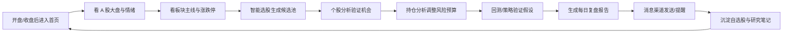
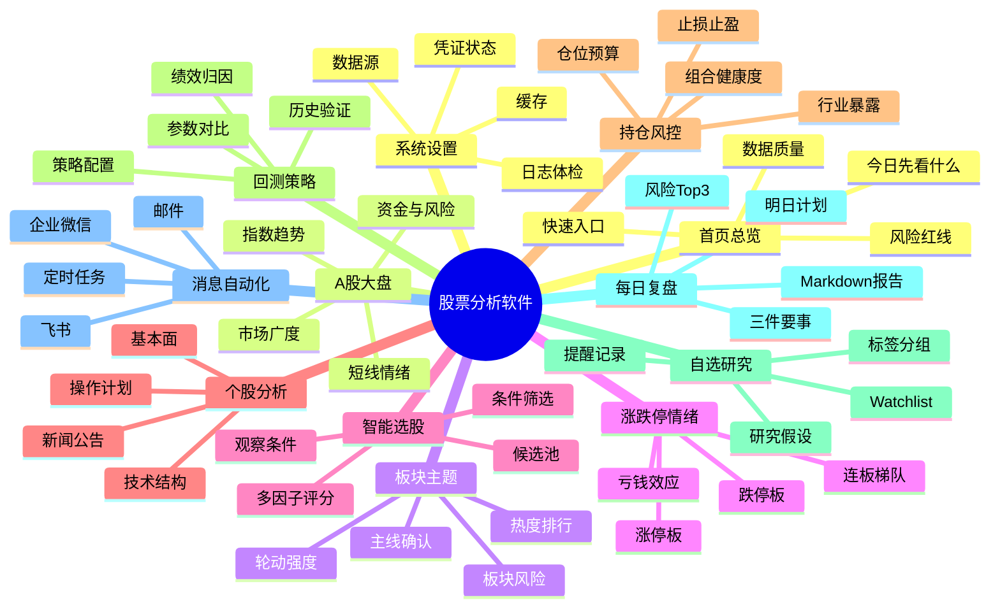
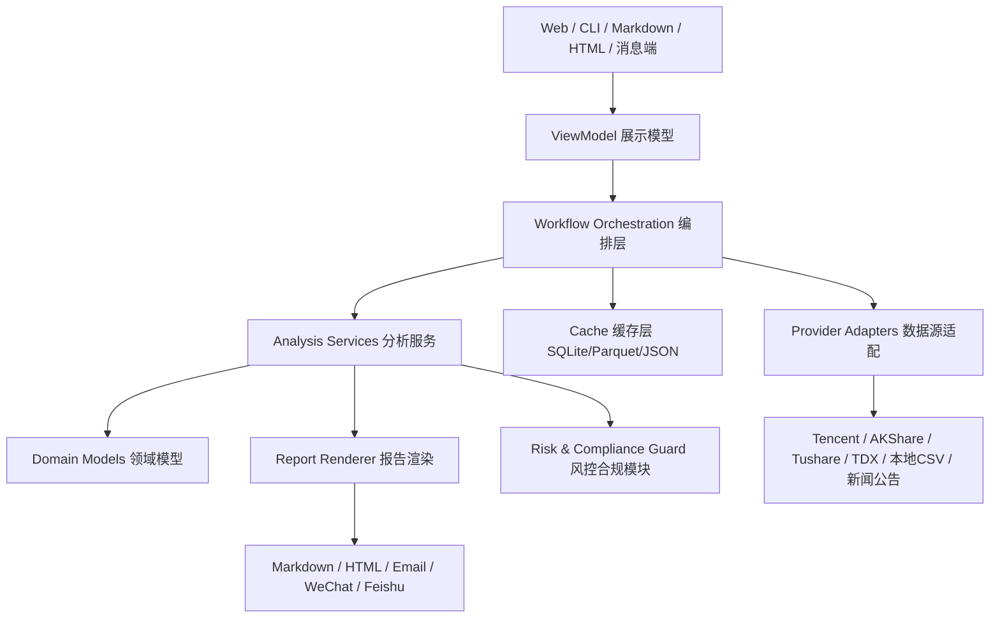
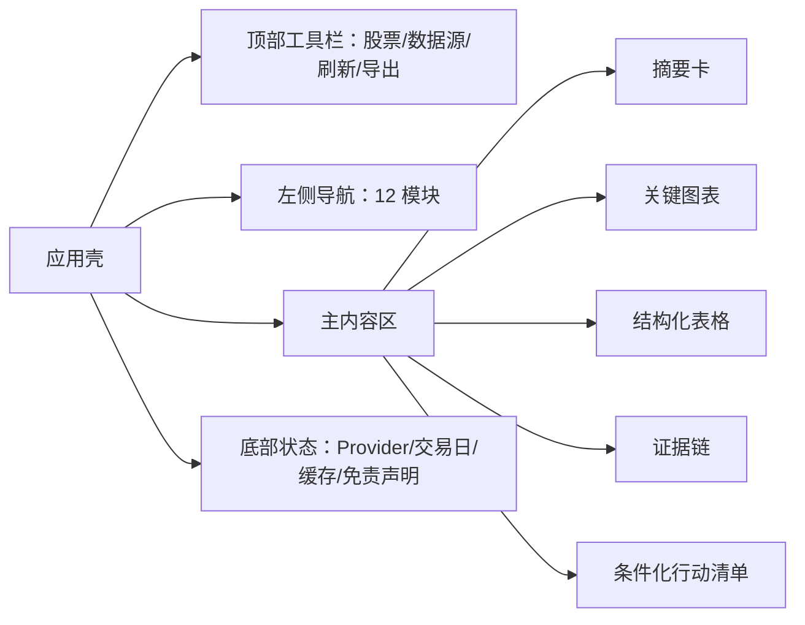
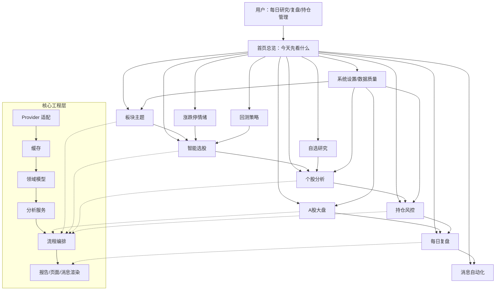

# 股票分析软件模块设计与开发思维导图

> 文档目标：把“股票分析软件应该有哪些模块、每个模块怎么展示、后续怎么开发”收敛成可执行框架。本文不构成投资建议，所有交易相关输出都必须用“研究、观察、条件、风险、失效”表述。

## 1. 参考项目与吸收原则

本设计参考了以下开源项目的产品/工程思想：

- OpenBB：强调“数据接一次，多端消费”，同一数据能力可供 Python、研究看板、Excel、API、AI Agent 等使用。参考：https://github.com/OpenBB-finance/OpenBB
- Qlib：覆盖数据处理、模型训练、回测、Alpha、风险建模、组合优化、订单执行的完整量化研究链路。参考：https://github.com/microsoft/qlib
- FinRL：把交易任务拆成市场环境、智能体、金融应用，并强调 train-test-trade / 风控 / 部署解耦。参考：https://github.com/AI4Finance-Foundation/FinRL
- Zipline：事件驱动回测、指标计算、绩效输出与 PyData 生态结合，适合作为回测模块的架构参照。参考：https://github.com/quantopian/zipline
- TradingAgents：用基本面、情绪、新闻、技术、研究员、交易员、风控、组合经理等角色分工和辩论提高解释性。参考：https://github.com/tauricresearch/tradingagents
- PKScreener / Stock Screener 类项目：强调可配置扫描器、突破/盘整/形态识别、提醒与候选池工作流。参考：https://github.com/pkjmesra/PKScreener

吸收原则：

1. 面向个人投研软件，不直接复制机构交易系统。
2. 先做“看得懂、可复盘、能验证”，再做自动化和 AI 增强。
3. 任何买卖建议都必须带来源、条件、风险、失效线和数据质量。
4. UI 只展示用户要做决策的信息，不暴露过多内部算法名词。
5. 工程层保持可测试、可替换数据源、可离线运行。

## 2. 五位资深工程师 100 回合对抗方法

用户要求 5 位资深工程师参与，并对每个模块对抗 100 次。为避免输出 100 x 模块数的低价值逐字稿，本文采用“100 回合压力矩阵”压缩记录：每个模块都按 5 个角色 x 20 个维度进行审查，共 100 次对抗。每个模块只保留收敛后的设计结论、展示规则和开发边界。

### 2.1 五个角色

| 角色 | 主要攻击点 | 最终守门标准 |
| --- | --- | --- |
| 软件交互师 | 用户第一眼能否知道先看什么、下一步点哪里、是否误导交易 | 3 秒内看懂结论，2 次点击内进入关键动作 |
| 股票分析师 | 指标是否专业、结论是否有证据链、是否符合 A 股语境 | 结论必须有市场、板块、个股、资金、风险至少 3 类证据 |
| 页面设计师 | 信息层级、视觉焦点、图表类型、移动端可读性 | 一个页面只有一个主问题，关键数字和风险标签优先 |
| 软件开发 | 模块边界、数据模型、缓存、接口、降级、可扩展性 | Provider、Service、ViewModel、Renderer 分层清楚 |
| 软件测试 | 可测性、边界条件、异常数据、离线回归、合规文案 | 每个模块有单元测试、集成样例、降级测试和免责声明 |

### 2.2 每个模块的 100 回合压力矩阵

每个模块按以下 20 个问题分别让 5 个角色审查，即 100 回合：

1. 这个模块只回答一个核心问题吗？
2. 首屏是否能给出明确但不越界的结论？
3. 数据来源、交易日、更新时间是否可见？
4. 示例数据、降级数据、过期数据是否显著提示？
5. 是否区分事实、推断、策略假设？
6. 指标是否可解释，普通用户能否理解？
7. 是否有风险标签和失效条件？
8. 是否避免“必涨、稳赚、无风险”等违规表达？
9. 表格列是否必要，是否可排序/筛选？
10. 图表是否服务判断，而不是装饰？
11. 是否支持空数据、接口失败、字段缺失？
12. 是否能离线样例运行？
13. 是否能写入 Markdown/HTML 报告？
14. 是否能被每日复盘复用？
15. 是否能被消息渠道摘要复用？
16. 数据模型是否稳定，不直接依赖外部 SDK 字段？
17. 是否需要缓存，缓存键如何设计？
18. 是否有最小可用版本和增强版本边界？
19. 是否有自动化测试覆盖主流程和异常流程？
20. 是否能在桌面和移动端保持可读？

## 3. 软件总体定位

### 3.1 产品一句话

StockTS 是一个面向 A 股个人投研的“每日分析 + 个股研究 + 持仓风控 + 复盘提醒”软件，不替代用户做交易，而是把数据、证据链、风险和执行纪律组织成可复用流程。

### 3.2 用户主流程



### 3.3 总体模块地图



## 4. 推荐模块清单

建议采用 12 个产品模块。前 9 个是用户高频模块，后 3 个是专业增强和系统支撑模块。

| 序号 | 模块 | 核心问题 | MVP 必须有 | 增强方向 |
| --- | --- | --- | --- | --- |
| 1 | 首页总览 | 我今天先看什么？ | 总结、风险、快捷入口、数据质量 | 个性化布局、用户关注模式 |
| 2 | A 股大盘 | 今天市场适合进攻还是防守？ | 指数、涨跌家数、成交额、情绪、风险 | 资金流、交易日历、历史分位 |
| 3 | 板块主题 | 主线在哪里，持续性如何？ | 板块热度榜、领涨板块、轮动提示 | 题材图谱、板块成分强弱 |
| 4 | 涨跌停情绪 | 短线赚钱/亏钱效应如何？ | 涨停、跌停、连板、炸板/封板提示 | 情绪周期、龙虎榜、异动提醒 |
| 5 | 智能选股 | 哪些股票值得观察？ | 多因子评分、筛选条件、候选池 | 自定义策略、AI 解释、自动提醒 |
| 6 | 个股分析 | 这只股票为什么值得/不值得跟踪？ | 技术、基本面、新闻公告、风险、操作计划 | 多角色辩论、估值模型、同业对比 |
| 7 | 持仓风控 | 我的组合现在安全吗？ | 持仓列表、盈亏、集中度、行业暴露、建议 | 交易流水、风险预算、再平衡 |
| 8 | 回测策略 | 这个想法历史上有没有效？ | 均线/条件回测、收益、回撤、胜率 | 多策略、滑点手续费、资金曲线 |
| 9 | 自选研究 | 我的长期观察池如何管理？ | Watchlist、标签、假设、提醒阈值 | 历史观察分、研究笔记、证据链 |
| 10 | 每日复盘 | 今天发生了什么，明天看什么？ | 摘要、报告、持仓风险、明日计划 | 自动生成、AI 润色、版本归档 |
| 11 | 消息自动化 | 如何把结论发给自己/团队？ | 邮件、企微、飞书、dry-run | 定时任务、分层推送、异常告警 |
| 12 | 系统设置 | 数据和系统是否可信？ | Provider、缓存、凭证状态、doctor | 数据血缘、任务队列、权限管理 |

## 5. 每个模块的设计结论

### 5.1 首页总览

**核心定位**：不是一个“大杂烩首页”，而是用户打开软件后的“今日行动导航”。

**首屏展示**：

- 今日一句话：用一句话说明市场状态，例如“市场偏震荡，优先看板块持续性，不追高”。
- 4 个关键卡片：市场热度、组合风险、候选机会、数据可信度。
- 风险红线：如大盘破位、情绪退潮、持仓集中、数据过期。
- 快速入口：A 股大盘、板块主题、个股分析、持仓风控、每日复盘。

**五角色对抗收敛**：

- 交互师坚持首页必须回答“先看什么”，不能堆所有指标。
- 股票分析师要求首页结论必须来自大盘、板块、持仓、候选池，不允许单指标定性。
- 页面设计师要求首屏不超过 6 张卡，重点数字比解释文字更醒目。
- 开发要求首页只消费各模块 ViewModel，不重新计算业务逻辑。
- 测试要求 sample 数据下首页必须稳定输出，并显式展示 sample 标识。

**开发接口建议**：

- `DashboardSummaryService`：聚合各模块摘要。
- `HomeViewModel`：只保留页面展示字段。
- `DataQualityBadge`：统一展示数据源、更新时间、降级原因。

### 5.2 A 股大盘

**核心定位**：判断市场环境，不负责推荐个股。

**展示结构**：

1. 市场状态条：进攻、震荡、防守、退潮。
2. 指数矩阵：上证、深成指、创业板、科创等。
3. 市场广度：上涨/下跌家数、涨跌停数量、成交额变化。
4. 风险闸门：是否低于均线、成交额萎缩、情绪退潮、外部风险。
5. 明日观察：关键指数点位、需要确认的信号。

**五角色对抗收敛**：

- 交互师反对一屏塞满指数 K 线，最终采用“状态条 + 关键指标 + 可展开图表”。
- 股票分析师要求成交额、市场广度、短线情绪三者共同判断。
- 页面设计师要求涨跌颜色、风险颜色和状态颜色统一，不混用。
- 开发要求指数、广度、资金流、风险评分拆成独立模型。
- 测试要求接口失败时不能显示旧数据为实时结论。

**关键测试**：交易日为空、指数缺失、涨跌家数为 0、数据过期、Provider 降级。

### 5.3 板块主题

**核心定位**：识别市场主线、轮动和风险扩散。

**展示结构**：

- 板块热度榜：涨幅、成交额变化、上涨占比、涨停数。
- 主线确认矩阵：强度、持续性、资金、新闻催化、风险。
- 轮动雷达：昨日强今日弱、低位补涨、高位退潮。
- 板块成分股：只展示代表股和风险股，避免全量表格噪音。

**五角色对抗收敛**：

- 交互师要求“主线是谁”优先于全量排行。
- 股票分析师要求板块强度不能只看涨幅，必须结合广度和成交。
- 页面设计师建议使用矩阵和标签，而不是多张相似柱状图。
- 开发要求板块实体和成分股实体分开，便于后续接 Tushare/AKShare/TDX。
- 测试要求板块为空时回退到“暂无可靠板块数据”，不使用虚假样例混淆。

### 5.4 涨跌停情绪

**核心定位**：给短线情绪和亏钱效应一个单独窗口。

**展示结构**：

- 今日情绪总览：涨停数、跌停数、连板高度、炸板率。
- 涨停板：代码、名称、板块、涨停时间、封单强度、连板数、打开次数。
- 跌停板：代码、名称、板块、原因标签、是否连续跌停。
- 情绪周期：冰点、修复、高潮、分歧、退潮。
- 风险提示：连板高度下降、跌停扩散、强势板块分歧。

**五角色对抗收敛**：

- 交互师要求涨停和跌停可分 Tab，但同属“情绪”模块。
- 股票分析师要求短线模块不能直接等同推荐买入涨停股。
- 页面设计师要求用梯队图展示连板高度，比普通表格更直观。
- 开发要求当数据源没有精确涨停字段时，必须标记“近似识别”。
- 测试要求 20cm、10cm、ST 5cm 涨跌停规则后续可配置。

### 5.5 智能选股

**核心定位**：生成“值得观察”的候选池，不输出确定性买卖结论。

**展示结构**：

- 筛选条件区：市场、板块、成交额、趋势、风险排除、公告排除。
- 排名表：综合分、趋势分、量能分、板块分、资金分、风险扣分。
- 入选理由：最多 3 条，必须可解释。
- 观察条件：什么信号出现才继续看。
- 排除原因：为什么某些热门股不进入候选。

**五角色对抗收敛**：

- 交互师要求默认给 Top 20，不让用户从几千只股票开始筛。
- 股票分析师要求评分公式透明，且风险扣分不能隐藏。
- 页面设计师要求表格支持排序、固定首列、标签色块。
- 开发要求筛选器配置和评分器分开，便于回测复用。
- 测试要求同一输入排序稳定，缺失指标有明确降权规则。

### 5.6 个股分析

**核心定位**：围绕单只股票输出证据链、风险和条件化操作计划。

**展示结构**：

1. 核心结论：观察、谨慎观察、回避、持有复核等。
2. 多角度评分：趋势、量能、板块、资金、新闻公告、风险。
3. 技术结构：均线、支撑、压力、RSI、MACD、量能比。
4. 基本面与公告：业绩、估值、减持、诉讼、监管、质押等。
5. 多角色对抗：多头观点、空头观点、裁判结论。
6. 操作计划：买入/加仓触发、减仓/止损触发、禁止动作。
7. 数据质量：行情日期、公告来源、新闻来源。

**五角色对抗收敛**：

- 交互师要求第一屏先给结论和失效线，再展开细节。
- 股票分析师要求技术、基本面、消息至少三类证据，不能只看 K 线。
- 页面设计师要求评分雷达和证据列表并列，避免长文报告压迫感。
- 开发要求 `StockAnalysisResult` 不直接包含 HTML，只包含结构化结论。
- 测试要求缺少新闻/公告时核心分析仍可运行，并明确降级。

### 5.7 持仓风控

**核心定位**：从“我有什么股票”升级为“我的组合风险是否可承受”。

**展示结构**：

- 组合健康度：总市值、浮盈亏、现金仓位、风险等级。
- 集中度：第一大持仓占比、前三大持仓占比。
- 行业暴露：行业权重、是否拥挤、是否和市场主线匹配。
- 持仓列表：成本、现价、盈亏、目标仓位、建议动作。
- 风控计划：止损线、止盈观察、禁止加仓条件。
- 持仓维护：CSV/交易流水导入、增删改入口。

**五角色对抗收敛**：

- 交互师要求把“在哪添加持仓”放在页面显眼位置。
- 股票分析师要求组合建议必须考虑大盘状态和行业集中。
- 页面设计师要求盈亏不是唯一视觉焦点，风险预算更重要。
- 开发要求支持 holdings 快照和 transactions 流水两种输入。
- 测试要求卖出后持仓归零、负成本、重复交易等边界可处理。

### 5.8 回测策略

**核心定位**：验证想法，不证明未来收益。

**展示结构**：

- 策略配置：均线、突破、回撤、止损止盈、调仓频率。
- 回测结果：年化、总收益、最大回撤、胜率、交易次数、盈亏比。
- 对照基准：买入持有、指数基准、空仓基准。
- 交易明细：买入/卖出日期、价格、原因、持仓天数。
- 局限说明：样本区间、幸存者偏差、手续费滑点、未来不可保证。

**五角色对抗收敛**：

- 交互师要求回测结果必须先显示风险，再显示收益。
- 股票分析师要求加入最大回撤和基准对照，否则收益无意义。
- 页面设计师要求资金曲线和回撤曲线并列展示。
- 开发要求采用事件驱动接口，为后续 Zipline/Backtrader 类引擎留口。
- 测试要求用固定 CSV 做 deterministic 回归测试。

### 5.9 自选研究

**核心定位**：沉淀长期观察池和研究假设，避免每天从零开始。

**展示结构**：

- 自选分组：核心持仓、短线观察、低位潜伏、风险排除。
- 研究假设：为什么关注、验证条件、失效条件。
- 标签系统：行业、主题、风格、风险、催化。
- 提醒：价格提醒、评分提醒、公告提醒、异动提醒。
- 历史记录：每次观察分和备注变化。

**五角色对抗收敛**：

- 交互师要求添加自选不超过 2 步。
- 股票分析师要求每个自选必须有“关注理由”和“失效条件”。
- 页面设计师要求用卡片分组展示，减少表格疲劳。
- 开发要求 watchlist 文件可本地 YAML/CSV，未来可迁移数据库。
- 测试要求重复代码、缺失名称、非法提醒阈值要校验。

### 5.10 每日复盘

**核心定位**：把分散分析组织成一份可以归档、复制、发送的日报。

**展示结构**：

- 今日一句话。
- 最重要的三件事。
- 大盘与板块复盘。
- 涨跌停和情绪复盘。
- 持仓风险 Top 3。
- 候选池 Top 20。
- 重点个股对抗摘要。
- 明日观察计划。
- 数据质量和免责声明。

**五角色对抗收敛**：

- 交互师要求报告有“一键复制”和“发送前预览”。
- 股票分析师要求日报必须区分已经发生和明日假设。
- 页面设计师要求摘要卡和 Markdown 正文并存。
- 开发要求日报从各模块结构化输出拼装，不重复计算。
- 测试要求报告包含免责声明、日期、数据源、核心章节。

### 5.11 消息自动化

**核心定位**：把报告、提醒、异常状态发送给用户，而不是变成复杂运维系统。

**展示结构**：

- 渠道状态：邮件、企业微信、飞书是否已配置。
- 发送样式：完整、摘要、行动清单。
- 操作按钮：发送测试消息、发送今日复盘、dry-run 预览。
- 推送规则：每日收盘、候选股触发、持仓风险、数据源异常。
- 安全提示：不展示完整 token，不记录真实凭证。

**五角色对抗收敛**：

- 交互师要求真实发送前默认 dry-run。
- 股票分析师要求消息摘要不能丢失风险和失效条件。
- 页面设计师要求渠道配置状态用清楚的 badge，不展示技术日志。
- 开发要求凭证只来自环境变量或本地安全配置。
- 测试要求 token 不出现在页面、日志、报告和异常堆栈中。

### 5.12 系统设置与数据质量

**核心定位**：让用户知道“这份分析可信到什么程度”。

**展示结构**：

- 数据源矩阵：sample、Tencent、AKShare、Tushare、TDX snapshot、本地导入。
- 数据质量：交易日、更新时刻、字段完整率、降级路径。
- 缓存状态：命中率、刷新按钮、缓存目录。
- 运行体检：依赖、配置、凭证状态、关键命令。
- 日志与错误：可读错误、修复建议、不要暴露密钥。

**五角色对抗收敛**：

- 交互师要求系统设置从用户语言解释问题，不只显示堆栈。
- 股票分析师要求数据质量必须进入每个分析结论。
- 页面设计师要求警告分级：提示、警告、危险。
- 开发要求 provider 层异常不能被分析层吞掉。
- 测试要求模拟每个 provider 失败路径。

## 6. 推荐技术架构

### 6.1 分层架构



### 6.2 核心数据对象

| 对象 | 说明 | 关键字段 |
| --- | --- | --- |
| `MarketSnapshot` | 大盘快照 | trade_date, indices, advancing, declining, amount, limit_up, limit_down |
| `SectorSnapshot` | 板块快照 | name, pct_chg, breadth, amount_change, limit_up_count, leading_stocks |
| `StockBars` | 个股 K 线 | code, name, bars, source, updated_at |
| `StockProfile` | 个股基本信息 | code, name, industry, market, pe, pb, market_cap |
| `NewsItem` | 新闻舆情 | date, source, title, summary, sentiment, url |
| `AnnouncementItem` | 公告事件 | date, title, category, risk_tags, url |
| `CandidateScore` | 候选评分 | score, trend, volume, sector, capital, risk_penalty, reasons |
| `HoldingPosition` | 持仓 | code, shares, cost_price, current_price, sector, note |
| `PortfolioAdvice` | 组合建议 | action, target_cash, position_targets, stop_loss, take_profit |
| `BacktestResult` | 回测结果 | return, max_drawdown, win_rate, trades, equity_curve |
| `DataQuality` | 数据质量 | provider, source, trade_date, is_sample, is_stale, warnings |

### 6.3 目录建议

```text
src/stock_ts/
  providers/              # 外部数据适配，字段标准化
  services/               # 大盘、板块、选股、个股、持仓、回测服务
  workflows.py            # CLI/Web 共用流程编排
  models.py               # 领域模型
  view_models.py          # 页面展示模型，可放 webapp/ 下
  report.py               # Markdown 报告
  html_report.py          # HTML 报告
  notification.py         # 消息发送
  risk_guard.py           # 合规措辞、免责声明、风险闸门
  cache.py                # 缓存抽象
  config.py               # 环境变量与安全配置
  cli.py                  # CLI 入口
  web.py                  # Web 入口

tests/
  test_market.py
  test_sectors.py
  test_sentiment_limits.py
  test_candidates.py
  test_stock_analysis.py
  test_portfolio.py
  test_backtest.py
  test_reports.py
  test_notifications.py
  test_data_quality.py
```

## 7. 页面设计框架

### 7.1 全局信息架构



### 7.2 通用页面模板

每个业务模块尽量统一成 6 层：

1. 模块标题：回答本页核心问题。
2. 一句话结论：不超过 40 字。
3. 关键指标卡：3 到 6 个。
4. 主图/主表：只承载核心判断。
5. 证据链与风险：来源、条件、反例、失效线。
6. 下一步动作：跳转、导出、发送、加入自选、复盘。

### 7.3 颜色与风险表达

- 红/绿按 A 股习惯：红涨绿跌。
- 风险颜色单独使用橙/红，不和涨跌混淆。
- 样例数据、过期数据、接口降级必须使用黄色/灰色警告条。
- “买入/卖出”类词汇只出现在用户自定义计划或条件化操作计划中，必须带触发条件和失效条件。

## 8. 开发优先级

### 8.1 MVP 阶段

目标：让用户每天能完成从大盘到复盘的闭环。

1. 首页总览
2. A 股大盘
3. 板块主题
4. 智能选股
5. 个股分析
6. 持仓风控
7. 每日复盘
8. 数据质量

验收标准：sample 离线可运行；真实数据源失败可降级；Markdown 报告可生成；核心页面有测试。

### 8.2 专业增强阶段

目标：增强短线情绪、研究沉淀和策略验证。

1. 涨跌停情绪
2. 自选研究
3. 回测策略
4. 消息自动化
5. 公告/新闻/舆情增强
6. 历史观察分趋势

验收标准：候选池能解释；回测有基准和回撤；消息 dry-run 安全；自选股能沉淀假设。

### 8.3 自动化与 AI 阶段

目标：减少重复劳动，但保留人工确认。

1. 每日定时任务
2. AI 研报增强
3. 多角色对抗摘要
4. 策略参数对比
5. 数据缓存升级 SQLite/Parquet
6. 结构化 JSON 输出和 Prompt 回放测试

验收标准：AI 失败不阻断主流程；成本可见；Prompt 和输出可回放；自动发送默认先 dry-run。

## 9. 测试框架

| 测试层 | 覆盖内容 | 示例 |
| --- | --- | --- |
| 单元测试 | 指标、评分、风控、报告段落 | 均线、RSI、候选评分、集中度 |
| 服务测试 | 模块服务输入输出 | 大盘分析、板块分析、个股分析 |
| Provider 测试 | 外部数据字段标准化与失败路径 | AKShare 字段变更、Tencent 超时 |
| 快照测试 | HTML/Markdown 关键结构 | 章节、免责声明、数据质量 |
| CLI 测试 | 命令参数与输出文件 | `market`, `stock`, `daily`, `send-daily` |
| Web 测试 | 导航、表单、模块可见性 | 12 模块导航、持仓编辑、消息 dry-run |
| 安全测试 | 凭证不泄漏、错误不暴露密钥 | token masking、日志脱敏 |

## 10. 合规与风控底线

必须遵守：

- 不承诺收益，不使用“稳赚、必涨、无风险”。
- 不自动下单，不接券商真实交易账户作为 MVP 能力。
- 所有结论保留“不构成投资建议”。
- 所有数据展示来源、交易日、更新时间和降级状态。
- 大模型输出必须被规则层包裹，不能单独作为交易依据。
- 外部接口 token、Webhook、邮箱授权码只从本地环境读取，不写入仓库。

## 11. 后续可按此框架拆分的开发 Epic

1. `epic-home-command-center`：首页总览与数据质量统一入口。
2. `epic-market-sector-sentiment`：大盘、板块、涨跌停情绪三件套。
3. `epic-candidate-screener`：智能选股、评分器、候选池解释。
4. `epic-stock-research`：个股深度分析、公告、新闻、多角色对抗。
5. `epic-portfolio-risk`：持仓、交易流水、组合建议、风险预算。
6. `epic-backtest-lab`：回测策略、绩效指标、资金曲线、参数对比。
7. `epic-watchlist-notes`：自选股、研究假设、标签、提醒。
8. `epic-daily-reporting`：每日复盘、Markdown/HTML、归档。
9. `epic-notification-automation`：消息渠道、dry-run、定时任务。
10. `epic-data-infra`：Provider、缓存、数据质量、体检。

## 12. 最终框架图



## 13. 一句话结论

股票分析软件不要从“指标大全”开始，而要从“每日决策流程”开始：先判断市场环境，再识别板块和情绪，再生成候选池，再做个股证据链验证，再校准持仓风险，最后形成可复盘、可发送、可回测的闭环。
